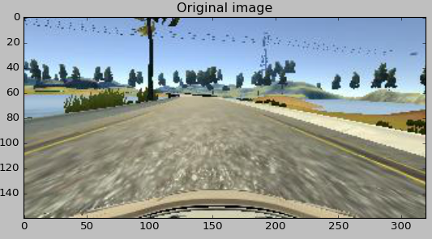
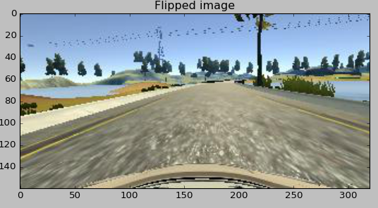
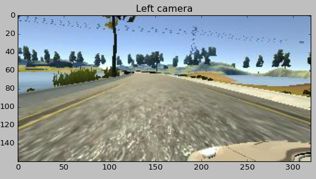
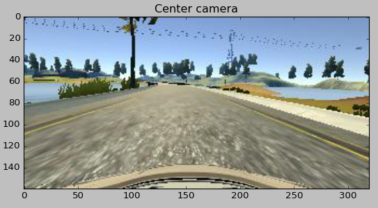
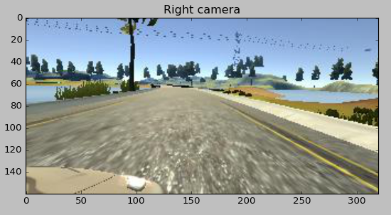
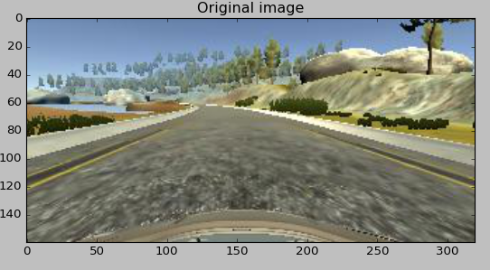
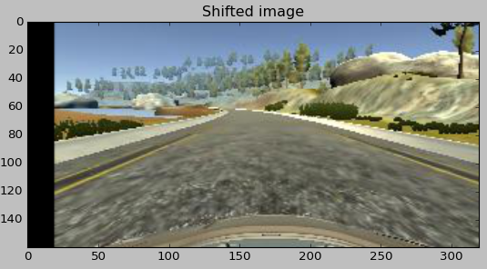
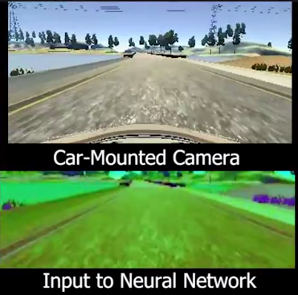

#**Behavioral Cloning**

##Writeup

---

**Behavioral Cloning Project**

The goals / steps of this project are the following:
* Use the simulator to collect data of good driving behavior
* Build, a convolution neural network in Keras that predicts steering angles from images
* Train and validate the model with a training and validation set
* Test that the model successfully drives around track one without leaving the road
* Summarize the results with a written report

## Rubric Points
###Here I will consider the [rubric points](https://review.udacity.com/#!/rubrics/432/view) individually and describe how I addressed each point in my implementation.  

---
###Files Submitted & Code Quality

####1. Submission includes all required files and can be used to run the simulator in autonomous mode

My project includes the following files:
* model.py containing the script to create and train the model
* drive.py for driving the car in autonomous mode
* model.h5 containing a trained convolution neural network
* writeup_report.md or writeup_report.pdf summarizing the results

####2. Submission includes functional code

The car is able to drive autonomously around Udacity's track in the latest Simulator, using the drive.py and model included in this repo:

```sh
python drive.py model.h5
```

*In addition, a recording of the car going around the track complete with network input and output visualisation is in `track1.mp4`.*

####3. Submission code is usable and readable

The model.py file contains the code for training and saving the convolution neural network. The file shows the pipeline I used for training and validating the model, and it contains comments to explain how the code works. Note that the datasets (a custom dataset was used for training) are not included, so the code will not work out of the box.

###Model Architecture and Training Strategy

####1. An appropriate model architecture has been employed

My model is based off the architecture by NVIDIA, in their paper [End to End Deep Learning for Self-Driving cars](https://arxiv.org/abs/1604.07316)

My model consists of a convolutional network consisting of 5 convolutional layers, of filter sizes 5x5 and 3x3. ELU activations are used to introduce non-linearity into the model, and a Lambda layer is used to normalize input data to the network.

After flattening the output, three Dense layers with ELU activations and dropout were used to condense the output to a single neuron, which corresponded to the steering angle of the car.

####2. Attempts to reduce overfitting in the model

Dropout layers are used after every hidden layer to reduce overfitting, and a l2 regularizer is also used on the convolutional weights.

Training and validation sets are based off a time-based split - as this will keep data leakage to a minimum and give more accurate validation results.

####3. Model parameter tuning

The model used an adam optimizer, so the learning rate was not tuned manually.

####4. Appropriate training data

Training data consists of several runs going straight around the track, as well as 'recovery data', showing the car recovering from being at the side of the track by steering towards the middle.

More details about how the training data was created are in the next section.

###Model Architecture and Training Strategy

####1. Solution Design Approach

Initially, I decided to start off with a simpler convolutional architecture, consisting of two convolutional layers. I split the udacity data in a time-based fashion and tried to see if I could learn a solution just by using the provided data and tuning the network. However, two things quickly became apparent:

1) Mean squared error is a bad approximation of how the car would drive on the actual track, meaning that I needed to test every model on the track rather than relying on validation.

2) The provided Udacity data did not include enough information on what the car should do at the edges of the track to recover, and because of this the car usually crashed if it went off course a little bit.

I decided that I should focus my efforts on data creation and augmentation, in order to show the network how to behave in suboptimal conditions and solve the second issue. To this end, I decided to settle on the architecture that NVIDIA used in their paper [End to End Learning for Self-Driving Cars](https://arxiv.org/abs/1604.07316). I thought this would be appropiate as it had enough layers to learn a complex and robust representation of the lane lines, and also because the final convolutional layer had an output with height 1 - this forces the dense layers to learn a horizontal representation of the convolutional output, which is good as the main information comes from identifying where the lane lines are horizontally.

In order to combat strong overfitting due to the relatively small training set, I added dropout (p=0.2) between all the hidden layers and a small weight regularizer to the convolutional layers. In addition, I made sure that I did not use random splitting for train/validation sets, instead using a time-based split. This is because with a random split there will be very similar frames in the training and testing sets, and this may not represent the actual situation with the autonomous simulator, where the testing frames are from a completely different time series to the training frames.

I then decided to work on creating additional data and augmenting the existing data in order to make the training process more robust - I believe this is the differentiator that meant that my algorithm was able to work autonomously. Detailed implementation details of this are in Section 3.

After training my model on the augmented data, the car was able to drive autonomously around the track. **A video of the model doing this is provided in the repo as `track1.mp4`.**

####2. Final Model Architecture

The final model architecture I used consisted of a convolutional neural network with 5 convolutional 'blocks' (a block consists of a Convolution2D layer, a ELU activation and a Dropout layer). After this, a flatten layer is used and fed into 3 dense 'blocks' (a block here consists of a dense layer, an ELU activation and a Dropout layer) followed by a single Dense neuron with no activation.

The network architecture was as follows:
1. Lambda layer - Normalization  
2. Convolution2D - 24 filters // size 5x5 // stride 2 // ELU activation // 0.2 Dropout  
3. Convolution2D - 36 filters // size 5x5 // stride 2 // ELU activation // 0.2 Dropout  
4. Convolution2D - 48 filters // size 5x5 // stride 2 // ELU activation // 0.2 Dropout  
5. Convolution2D - 64 filters // size 3x3 // stride 1 // ELU activation // 0.2 Dropout  
6. Convolution2D - 64 filters // size 3x3 // stride 1 // ELU activation // 0.2 Dropout  
7. Flatten
8. Dense - 100 neurons // ELU activation // 0.2 Dropout  
9. Dense - 50 neurons // ELU activation // 0.2 Dropout  
10. Dense - 10 neurons // No activation // No Dropout  
11. Dense (output) - 1 neuron // No activation

In total, the network had 252,000 trainable parameters. Here is a visualization of the architecture:

![network graph visualization][modelviz]
[modelviz]: model.png

####3. Creation of the Training Set & Training Process

Firstly, I captured an additional 40,000 training samples over and above what Udacity provided with the project, in order to make the model more robust. This consisted of several laps going around the track, sometimes further towards the left side of the lane, and sometimes more towards the right. This was in order to teach the car what to do if it strayed away from the centre of the lane (it is worth noting that in autonomous mode the car does not actually start in the centre of the lane.)

In addition, I collected a large amount of recovery data - this is data where the car was correcting itself from a course which would go into the side of the road. I efficiently collected this by zigzagging through the lane, and using the R key to only record data when the car was correcting, and not when the car was driving in the wrong direction.

When this data was collected, I decided to use Udacity's dataset for validation and my dataset for training.

After collecting this additional data, I decided to focus on data augmentation. First, I cropped the image by removing the bottom 25 pixels (where the car bonnet was visible) and the top 50 pixels (where other things such as trees were visible). This left me with a clear view of the road.

Since the track mainly involes turning left, to remove any bias towards turning left I decided to mirror the data, horizontally flipping the image and the angle. This meant that the data had a symmetrical distribution and a mean of zero, forcing the network to actually learn when to turn left and when to turn right.




In addition, I decided to incorporate the images from the left and right cameras into my data (the images from these cameras can be used to generate data as if the car was further to the left or right on the track). When the left camera was used, I offset the steering angle by 0.25 to the right, and vice versa.





I used `cv2.warpAffine` to generate even more augmented steering data by shifting the camera images a random value to the left or right (up to 80 pixels) and then augmenting the . This ensured that the network learnt that it was the _position_ of the lane that mattered, instead of fitting to noise such as objects in the background. In addition, this meant that the distribution of steering angles was more normal, instead of having three peaks which meant that the trained network would always predict one of those three values.




Finally, all the images were converted to an HLS colour space and resized to (66, 200) so that the output of the final convolutional layer had a height of 1. These images were passed to the network.



All this processing was done in a generator that I set Keras to multithread, and only the images for the current batch were ever loaded in memory, in order to keep the memory usage to a minimum.
